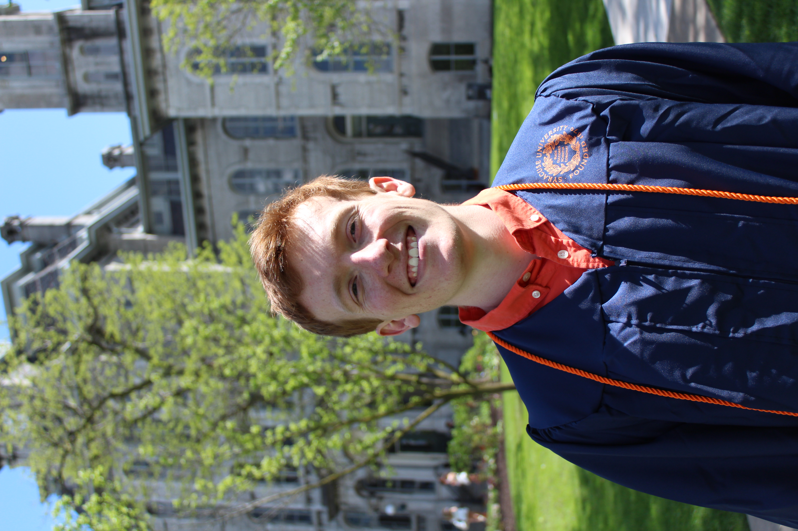

# My name is Brett Gustin, and I am a Data Analyst from Syracuse, NY. I went to school at Syracuse University and earned my BS in Sport Analytics. My love and passion for sports since a young age, particularly basketball and baseball, along with math and science helped me through my educational journey. I have so far worked within and outside of the sports setting, always with a passion to use data science and machine learning applications to drive efficient business decisions. 

